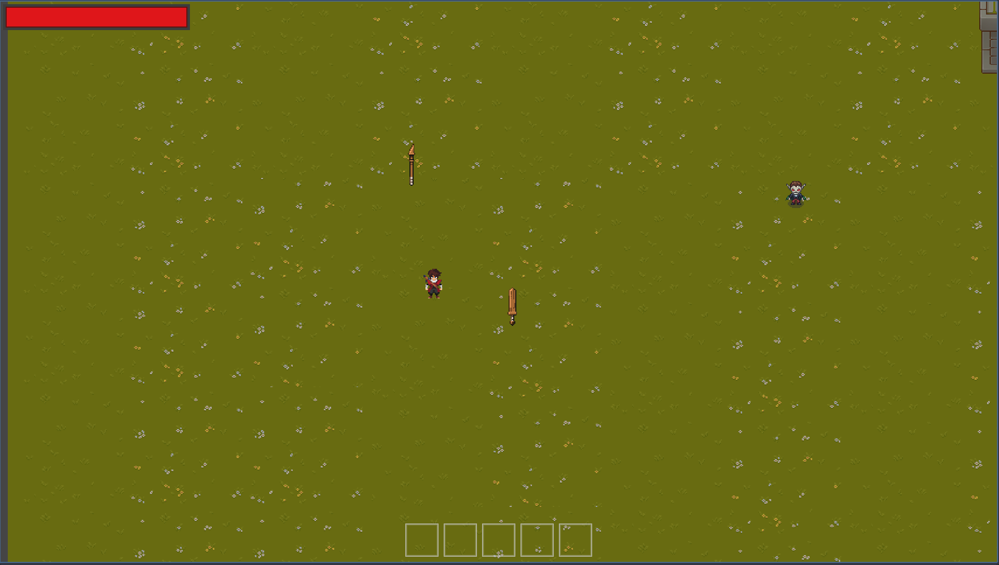

### HellyBurton
#### MVP

- 2D top-down pixel art rpg
- Singleplayer Story game
- Features: 
   - dynamic fighting system (smart enemies, dodging, attacking, blocking, melee and ranged weapons, "magic" in form of vampire powers)
   - story telling through dialog system
   - linear story 
   - farming
   - mining
   - leveling
   - fishing
   - static map design
   - inventory system
- Story (may be changed in the future):
   - main character is the son of an evil vampire
   - a small group of vampires want to live in peace with the humans
   - they capture the main character and wipe his memories
   - main character lives with humans to be an example of a friendly vampire
   - the leader of the group of friendly vampires plots something big and frames the main character as the hero at the end of the story
   - main character saves humanity and gets accepted, even though it gets revealed he is a vampire

#### Progress - finished features
- dialog system
- player attacking with melee weapons
- inventory system
- moving enemies
- damage system
- enemy models
- main character model
- 

